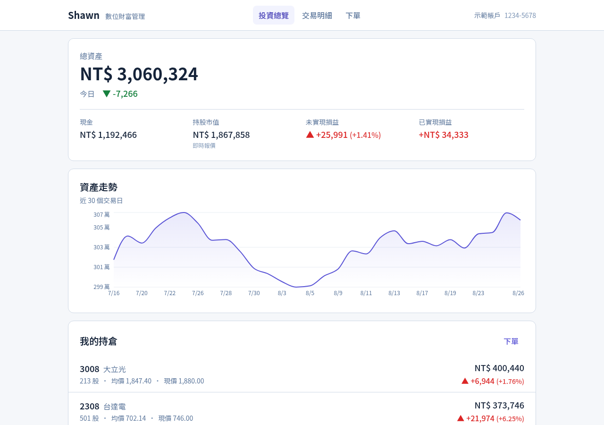
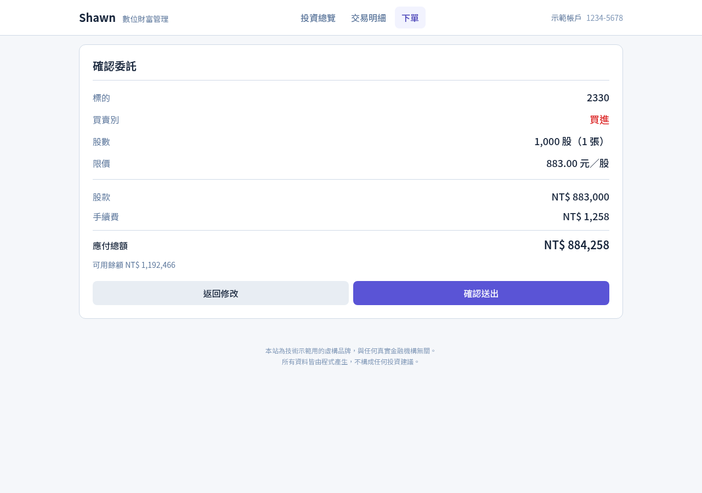
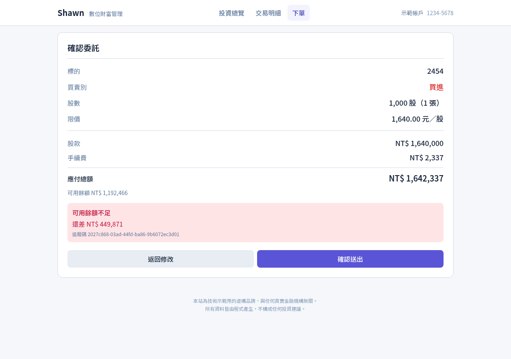
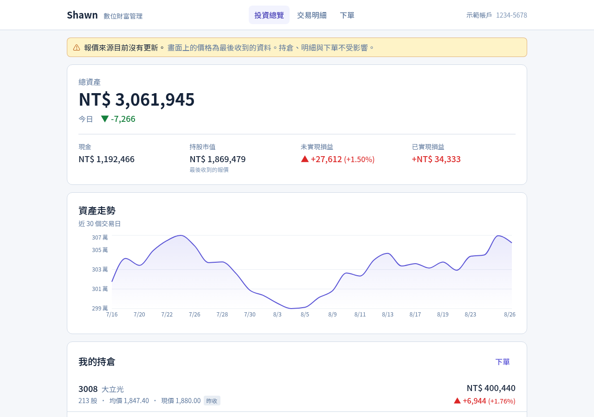

# Shawn 財富 — 數位財富管理

> 台股情境的全端交易系統。虛構品牌，與任何真實金融機構無關；所有資料由程式產生，不構成任何投資建議。
>
> React 19 · NestJS 11 · PostgreSQL 16 · Redis 7 · TypeScript strict · Docker Compose
>
> `Last verified: 2026-08`

**[線上展示 →](https://seanhong1215.github.io/digital-wealth/)**　demo 帳號 `demo@digital-wealth.local` / `demo1234`（登入頁有一鍵填入）

---

## 這是什麼

一個數位財富管理系統的前台與帳務核心 —— 對應台灣金控 App 中的「投資／理財」分頁。

涵蓋一般散戶會用到的完整路徑：查看資產與持倉、追蹤即時報價、瀏覽數千筆交易明細、
完成一次限價下單。後端處理的是金融系統真正的難題：交易一致性、金額精度、失敗與降級。

| | 內容 |
|---|---|
| **線上版**（GitHub Pages） | 前端 UI。資料由瀏覽器裡的 [MSW](https://mswjs.io/) 提供，與後端 seed 用同一份規則與種子 |
| **本機版**（Docker Compose） | 完整全端。真實的 PostgreSQL 行鎖、Redis pub/sub、WebSocket |

線上版沒有後端，因此**演不出並行競態**（`SELECT … FOR UPDATE`）—— 瀏覽器的 JavaScript 是單執行緒。
要看那部分請跑本機版。

---

## 啟動

```bash
cp .env.example .env          # 填入 JWT_SECRET：openssl rand -base64 32
docker compose up -d
```

開 **http://localhost:8090**。Migration 與 seed 全自動，無任何手動步驟。
從空的資料庫起算 17 秒五個服務就緒。需要 Docker，約 1.5GB 磁碟空間。

---

## 60 秒 demo


登入 → 投資總覽（報價即時跳動）→ 交易明細（虛擬滾動 3,001 筆）→ 下單被拒（餘額不足）
→ 下單成交 → 關掉 market-feed 觀察降級。

原始畫質版本：[`docs/media/demo.mp4`](docs/media/demo.mp4)（74 秒，未加速）。

---

## 使用者流程

```
登入
 └─ /portfolio  投資總覽 ★ 預設首頁
     ├─ 總資產、今日損益、現金、持股市值、未實現／已實現損益
     ├─ 資產走勢曲線（近 30 個交易日）
     └─ 持倉列表 —— 即時報價、現價、漲跌
         └─ 點任一列 → 下單流程（帶入該檔標的）

 └─ /transactions  交易明細
     ├─ 類型篩選：全部／買進／賣出／費用與稅／股利（同步至網址）
     └─ 虛擬滾動，捲到底自動載入下一頁

 └─ /trade  下單（四個步驟，每步都是獨立路由）
     ├─ /trade                    選擇標的（搜尋代號或名稱）
     ├─ /trade/:symbol            填寫委託 —— 買賣別、股數、限價
     │                            即時顯示現價、漲跌停、預估費用
     ├─ /trade/:symbol/confirm    確認 —— 後端試算的實際費用
     └─ /trade/:symbol/result     結果 —— 成交明細與委託編號
```

**⚙ Demo 控制台**（右下角浮動面板，非路由）可即時切換四種帳戶情境
與五種故障注入，狀態同步至網址，情境連結可分享。

| 情境 | 內容 |
|---|---|
| 新用戶 | 無持倉、無明細 —— 空狀態 |
| 一般帳戶 | 11 檔持倉、3,001 筆明細 |
| 餘額不足 | 現金 500 元 —— 下單必失敗 |
| 大量明細 | 約 7,600 筆 —— 虛擬滾動壓測 |

| 故障 | 觀察什麼 |
|---|---|
| 伺服器錯誤 | 全頁錯誤與 traceId |
| 請求逾時 | 「狀態未知」的處理 |
| 慢速網路 | 骨架屏 |
| 下單被拒 | 失敗分支，其他功能不受影響 |
| 報價中斷 | 降級顯示 |

---

## 畫面

| 投資總覽（即時報價） | 下單確認 |
|---|---|
|  |  |

| 下單被拒 | 報價中斷（降級） |
|---|---|
|  |  |

---

## 架構

四個服務 ＋ 兩個基礎設施，由 Docker Compose 編排。

```
              ┌──────────┐
   瀏覽器 ───▶│   web    │  nginx：靜態檔 ＋ 代理 /api（含 WebSocket 升級）
              └────┬─────┘
                   │ /api
              ┌────▼─────┐        ┌──────────────┐
              │   api    │◀──────▶│  postgres    │  帳戶、持倉、明細、委託
              │ NestJS   │        └──────────────┘
              └────┬─────┘
                   │ subscribe    ┌──────────────┐
                   └─────────────▶│    redis     │  報價 pub/sub ＋ 下單冪等鍵
                                  └──────▲───────┘
                                         │ publish
                                  ┌──────┴───────┐
                                  │ market-feed  │  報價產生器（可單獨關閉）
                                  └──────────────┘
```

### 專案結構

```
shared/          前後端共用契約 —— zod schema、money.ts、market-rules.ts、errors.ts
  simulation/    假資料與價格模擬。seed、market-feed、瀏覽器 mock 三邊共用

api/             NestJS。Controller → Service → Repository 三層
  modules/
    orders/      下單：transaction ＋ 行鎖 ＋ 冪等鍵
    quotes/      WebSocket Gateway，Redis 訂閱後依訂閱扇出
    demo/        情境切換與故障注入（動態模組，正式環境不註冊）
  database/      連線池、交易封裝、migration、seed

web/             React 19 + Vite
  features/*/api/          唯一與後端對話的層
  features/*/components/
  routes/                  頁面
  shared/{ui,lib}
  mocks/                   MSW 假後端（僅測試與靜態版載入）

market-feed/     報價產生器 → Redis publish
```

**兩條硬性分層規則**

1. 前端：`features` 底下的 `components` 不得直接呼叫 `fetch`，一律經由同 feature 的 `api` 層
2. 後端：Controller 不得直接碰資料庫，一律經由 Service → Repository

---

## 技術棧

| 領域 | 選擇 |
|---|---|
| 前端 | React 19、Vite、TanStack Query、TanStack Virtual、Recharts、Tailwind v4 |
| 即時報價 | 外部 store ＋ `useSyncExternalStore`（逐檔訂閱、逐列重繪） |
| 後端 | NestJS 11、原生 SQL（不用 ORM）、原生 WebSocket（`ws`） |
| 資料 | PostgreSQL 16、Redis 7 |
| 契約 | Zod，放 `shared/`，前後端與模擬層共用 |
| 認證 | JWT ＋ httpOnly Cookie |
| 金額 | 整數「分」＋ branded type `Cents`，禁用浮點數 |
| 測試 | Vitest（108 個），MSW |
| 部署 | Docker Compose ＋ GitHub Pages |

決策理由與替代方案見 [`docs/00-architecture.md`](docs/00-architecture.md) 與 [`docs/adr/`](docs/adr/)。

---

## 開發指令

```bash
npm run dev:api      # 後端（:3000，watch 模式）
npm run dev:web      # 前端（:5173）
npm run dev:feed     # 報價產生器
npm run dev:mock     # 前端 ＋ 瀏覽器假後端（不需要 api / DB / Redis）
npm test             # 108 個測試
npm run typecheck    # 全 workspace 型別檢查
npm run db           # psql 進資料庫
npm run build:pages  # 建置 GitHub Pages 版本
```

容器版與本機開發版不能同時跑 —— 兩者都要綁 :3000。

---

## 已知限制

- 模擬撮合是同步的、限價全額成交，不模擬部分成交或排隊
- 只有一個 demo 帳號，不做註冊與多使用者
- 沒有 HTTP 頻率限制（僅 WebSocket 訂閱上限 100 檔）
- 前端 bundle 約 770KB（gzip 231KB），未做 code splitting
- 線上版無法演示並行競態；資料只存在記憶體，重整回到初始情境

---

## 文件

| | |
|---|---|
| [`docs/00-architecture.md`](docs/00-architecture.md) | 服務拓撲、模組拆解、技術棧、前後端分工 |
| [`docs/01-proposal.md`](docs/01-proposal.md) | 網站結構、功能範圍、沒做的以及為什麼 |
| [`docs/02-backend.md`](docs/02-backend.md) | ER 圖、Schema、交易一致性、API 表、WS 協定、錯誤碼 |
| [`docs/03-presentation.md`](docs/03-presentation.md) | 格式化規範、狀態推導、警示策略 |
| [`docs/04-design-system.md`](docs/04-design-system.md) | Design Token、元件清單 |
| [`docs/05-specs/`](docs/05-specs/) | 各頁面的實作規格 |
| [`docs/07-reading-guide.md`](docs/07-reading-guide.md) | 程式碼閱讀路線圖 |
| [`docs/adr/`](docs/adr/) | 11 則決策紀錄 |

---

> **本專案為虛構品牌，與任何真實金融機構無關。**
> 所有資料皆為程式產生的假資料，不構成任何投資建議。
